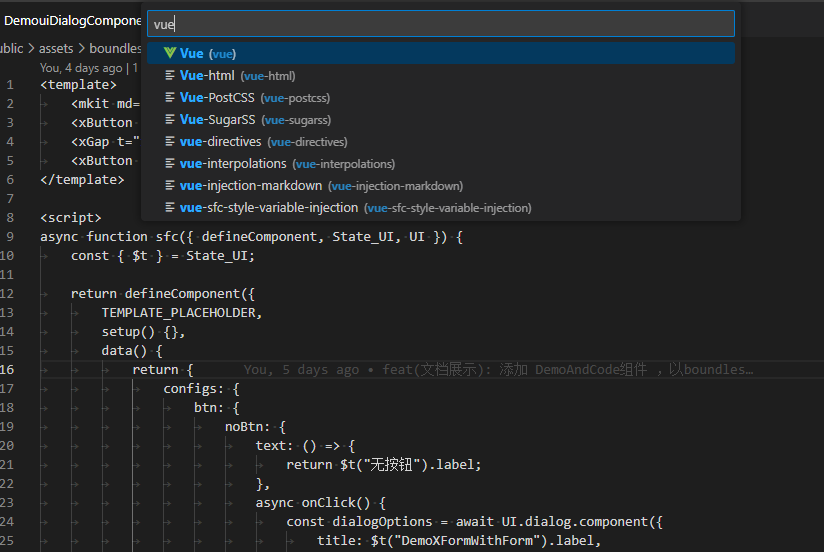
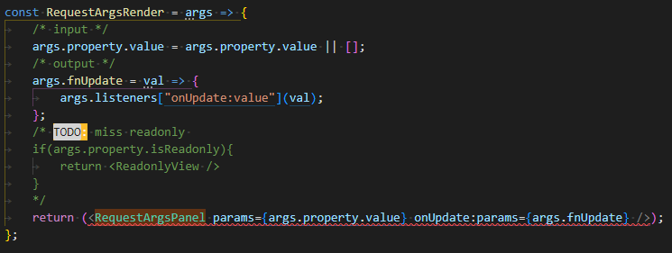

# todo

[TodoList](./README.todo.md)

### less

/* @list:0 3 4 5 8 9 10 13 14 15 16 20 24 25 30;

@len:length(@list);

.makeMP(@index) when (@index > 0){
	@i:extract(@list,@index);
	.margin@{i} {
		margin: @i * 1px;
	  }
	  .makeMP(@index - 1)
}

.makeMP(@len); */


## Boundless

在编辑sfc文件时，可以手工使用vue的高亮语法。之所以不用vue后缀，是因为以后可能还有其他的解析，不与官方的混淆。


## dev

`___VENTOSE_UI_IS_DEV_MODE`

## Reference

- []()

  - npm update --depth=9999 vue-loader

- [layuiweb](https://www.layuiweb.com/doc/modules/layer.html#closeBtn)
- [Vue3](https://v3.cn.vuejs.org/api/)
  - [sfc-script-setup](https://v3.cn.vuejs.org/api/sfc-script-setup.html)
  - [composition-api-lifecycle-hooks](https://v3.cn.vuejs.org/guide/composition-api-lifecycle-hooks.html)
  - [Vue-Router](https://next.router.vuejs.org/zh/introduction.html)
- [ant-design-vue](https://next.antdv.com/components/overview-cn/)
  - [Ant Design Vue3](https://mp.weixin.qq.com/s?__biz=MzU4NTgyMTM0MQ==&mid=2247484357&idx=1&sn=478c97c3ddd1703f4851863a8f4b2863&chksm=fd85fe37caf27721818cfcef9521116cb54ca4c023951445ed71a1d87786c383f2888d64035f&mpshare=1&scene=23&srcid=10203hvGd6nN3z8bEYuCS1LI&sharer_sharetime=1634692039568&sharer_shareid=966f440169937ddeabee7cec964be6bc#rd)
  - [ant-design-vue-pro](https://github.com/vueComponent/ant-design-vue-pro)
    - [pro-layout](https://github.com/vueComponent/pro-layout)
- [URL-friendly characters](https://stackoverflow.com/questions/695438/what-are-the-safe-characters-for-making-urls)
- [popover](https://www.jqueryscript.net/blog/best-popover.htm)
- [popper](https://popper.js.org/)
- [regexper 正则可视化](https://regexper.com/#%2F%5B%7D%7B*%60~!%40%5C%23%5C%24%5C%26%5C%28%5C%29%5C-%5C_%5C%3D%5C%2B%5C%5B%5C%5D%5C%7C%3B%3A'%5C%22%2C%5C.%5C%2F%5C%3F%25%5C%5E%5D%2F)

> 关于命令式代码，私以为诸如 `tips`、`popover`、`confirm`、`dialog` 这类的场景都是合适的，一味无脑使用声明，颇有一种手里只有一把锤子的意思。

## jsx slot 的写法

> [vue-jsx-next](https://github.com/vuejs/jsx-next)

```js
const genMenu = () => {
	const MenuItemRender = menuInfo => {
		if (xU.isArrayFill(menuInfo.children)) {
			/* 第一种 */
			return (
				<SubMenu
					v-slots={{
						icon: () => <AppleOutlined />,
						title: () => menuInfo.label,
						default: () => xU.map(menuInfo.children, MenuItemRender)
					}}
				/>
			);
		} else {
			/* 第二种 */
			return (
				<MenuItem key={menuInfo.id}>
					{{
						icon: () => <UserOutlined />,
						default: () => <span>{menuInfo.label}</span>
					}}
				</MenuItem>
			);
		}
	};
	return xU.map(props.tree, MenuItemRender);
};
```

## 常用函数

### $t 多语言转换

- 懒加载，最好是当前模块用到的才加载。
- 如何做到异步？使用 DelayCall function？

单一数据源`build/make/language.js`

```json
{
	"make:language": "node ./build/make.js language"
}
```

```js
return { label: "显示的对应语言", prop: "key" };
```

```js
/* main.js 第一行 window._ 工具 常用工具函数 */
import "@ventose/ui/loadCommonUtil.js";
```

## appPlugins

针对 popover 单例的使用，Vue3 以应用为单位配置属性的方式相较于 Vue2 的全局配置，带来了灵活，就需要但对每个应用单独配置，

```js
/* Vue3 组件方式加载 popover content */
if (this.options.component) {
	this.$popoverMountDOM = $(
		`<div id="${this.id}" class="x-popover-content"/>`
	).prependTo($("body"));
	const popoverApp = createApp(this.options.component);
	/* 独立应用，配置是否共享、同步，可以配置，此处用appPlugins方法，保持一致 */
	appPlugins(popoverApp);
	const vm = popoverApp.mount(`#${this.id}`);
	this.$popoverDOM = $(vm.$el);
	this.$popoverDOM.appendTo(this.$popoverMountDOM);
	return;
}
```

与 Vue2 处理方式不同，需要使用 appPlugins 给`createApp`返回的`app`添加 plugin。应对 app 独立化后，无法共享 component 依赖的特性。

## 状态管理 ~~VueX~~

> 视图归视图，状态归状态

- State\_\*: 状态（变量）
- Methods\_\*: 方法
- Cpt\_\*: 计算属性 .value

Vue2 中的 this 就是用来保存状态，Vue3 的进步之处在于状态的解耦。

xItem 的设计与使用充分基于这种原则，xItem 视图本身，与 configs 相关，状态与 v-model 绑定相关。


xItem value可以直接用configs里面的value 不需要额外的v-model
```js
/* FILE:src\state\State_App.js */
/* state State_App 相当于命名空间*/
export const State_App = reactive({ configs: lStorage.appConfigs });

/* getter 就用computed代替;commit直接修改StateApp  */
export const APP_LANGUAGE = computed({
	get: () => State_UI.language,
	set: lang => (State_UI.language = lang)
});

/* 副作用 effect */
/* 同步AppConfigs 到 localStorage */
watchEffect(() => (lStorage.appConfigs = State_App.configs));

/* actions 异步修改 效果同事务 自己去保证原子性 */
export const Actions_App = {
	GetInfo: async () => {},
	Login: async () => {},
	Logout: async () => {}
};
```


## 开发

App.vue 中完成

## pro-component

### xItem

错误信息可以单独提供，默认是在 formItem 下方展示 tips ，也可以利用错误信息做其他展现方式，比如 popup， 提供 id 定位，方便滑动定位 vModel 与配置信息分开


xItem 作为 controller ，具体的render 如 input 提供具体的处理能力，1，editor（disabled是editor的能力） 2，readonly 模式（只做展示，可以更个性化）itemType接受的是render函数


- 参考
  - `src/views/user/LoginCredentials.vue`
  - `src/views/user/State_Login.jsx`

```js
import {State_App} from "@ventose/state/State_App";
import {defItem, ITEM_TYPE} from "@ventose/ui";
import {watch} from "vue";

- [ ] 自定义组件的校验如何处理?

const inputConfigs = defItem({
    type: ITEM_TYPE.input,
    onAfterValueEmit: (configs) => {
        State_App.count++;
    }
});
const state = reactive({name: ''})

watch(() => State_App.count, (count) => {
    State_App.count = count;
});
```

```html
State_App.count: {{State_App.count}}
<xItem :configs="inputConfigs" v-model="state.name" />
```

### xDataGrid

- 拖动排序 字典下拉顺序=> order 的修改

### Utils

- 设置 title
  - setDocumentTitle()
- root var css 变量
  - setCSSVariables

## 自定义的折叠按钮(未使用)

```html
<!--    <xRender :render="render.collapsedButton" :collapsed="State_App.collapsed"/>-->
```

## log

1. `no-mutating-props`:`MutatingProps`
2. `pickValueFrom`：从 xItem 的 configs 中获取 value；
3. xItem 错误提示随语言切换变更 涉及到 $t 的配置项都需要 ()=>

- 20211117 登陆框 blur 未触发 update 校验
- 20211127022841 v-uiPopover
- 20220110095314
  - xIcon ：异步，动态懒加载 src\assets\svg 目录下单个文件，经过插件处理，分别打包成独立文件
  - SvgRender: 同步，首页不想让用户看到 loading 状态，可提前加载图标

```html
<!-- src\assets\svg\lockStrok.svg -->
<xIcon
	icon="lockStrok"
	style="color: red; height: 100px; width: 100px; outline: 1px solid black; margin: 10px; " />
```

- 20220328210842

国际化,用于内部通信

```js
export const State_UI = reactive({
	language: lStorage["language"] || "zh-CN",
	/* svg 的路径  */
	assetsSvgPath:'',
	$t: (prop, payload) => ({
		label: prop
	})
});
```

xItem msg 可以是 function 根据传入的参数显示不同信息
raw$Value update:value
## 动态加载 svg icon

```js
/* 在App中应用，UI lib 中 内置，直接引用 */
const icons = import.meta.glob("../../assets/svg/*.svg");
const modules = {};

```