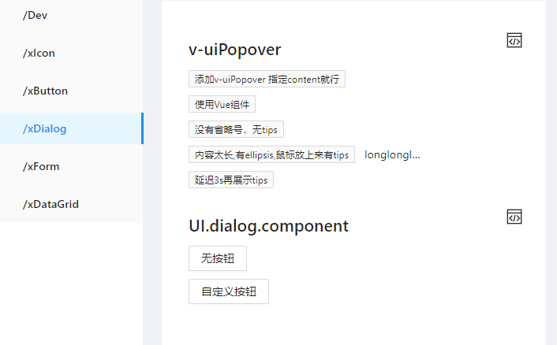
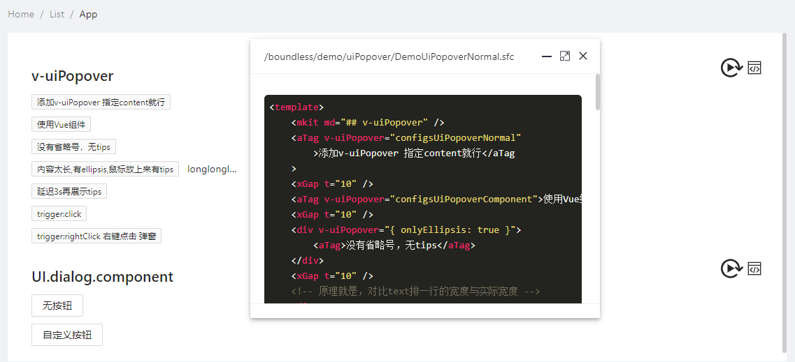

[Home](./README.md)

## 通用

- [x] indexeddb 前缀，方便清理和枚举

- [x] compileVNode

## 工具函数

- [x] xU.useScopeCss css样式编辑方案

## 组件 

- [x] Demo页面加载独立的vue文档，弹窗展示源码
  
- [x] 使用boundless方式加载demo文件
  - [ ] css scoped 的解析  
- [ ] 
- [ ] 允许动态修改demo文件，然后主动触发运行
- [ ] datagrid
  - [ ] isHideFilter: true,
  - [x] selectedConfigs  如果有，就是单选或者多选
  - [x] 添加class，通过文本的形式
- [ ] layer
    - [ ] 弹窗效果从点击位置打开，openAtPoint
    - [ ] tips
    - [ ] dialog
      - [ ] 动画 fullscreen
      - [x] resize
      - [x] esc 一次只退出一个
      - [ ] esc 退出最上层dialog
    - [ ] confirm
      - [ ] 改成用layer
      - [ ] 样式FLIP 动画
    - [ ] tips 的样式
      - [用SVG实现一个优雅的提示框](https://zhuanlan.zhihu.com/p/143876210)
      - [daimabiji](http://demo.daimabiji.com/1553/)
    - [x] onlyEllipsis:只有在出现省略号的情况下才弹出tips（延迟显示）
    - [x] 使用组件的时候，rePosition
    - [x] click uiPopover 的处理
    - [x] click 右键 的处理
    - [x] layerIndex 动态增减
- [ ] 虚拟列表 onSelectedChange emit
- [ ] 组件的单独加载？
    - [x] 参考DemoAndCode
    - [ ] 路由与视图的 import 加载，默认文件夹？

### i18n

- [ ] $t

### xItem

- [ ] readonly模式

## 指令

- [x] v-uiPopover
- [x] v-uiMove